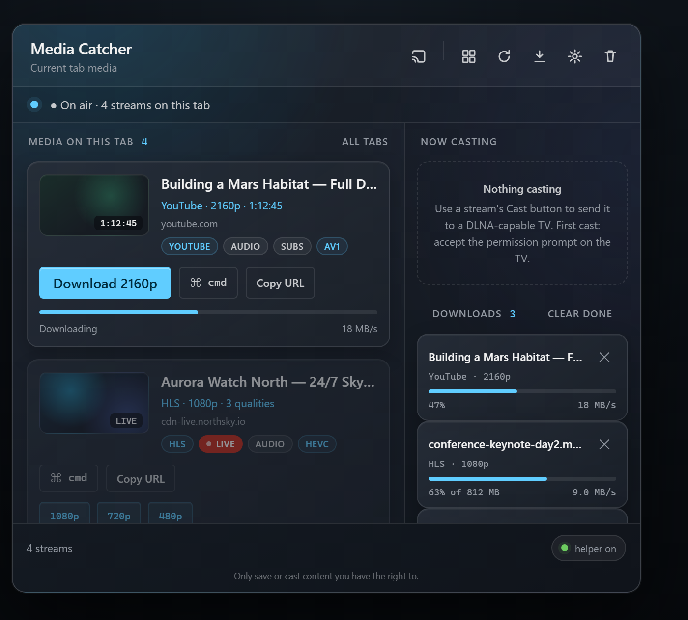
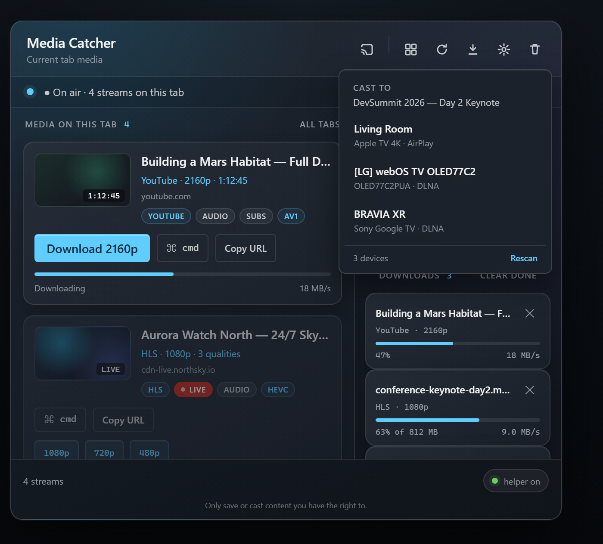
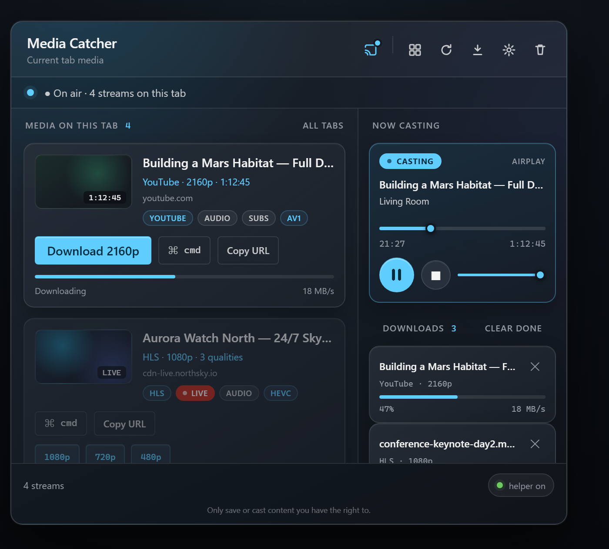

# Media Catcher

[](https://github.com/g9xdev/mCatcher/releases/latest)
[](https://github.com/g9xdev/mCatcher/releases)
[](https://github.com/g9xdev/mCatcher/actions)

A Firefox extension plus a native helper that detect, download, and record live
web video and HLS streams to real files on disk.

### ⬇ [Download the latest release](https://github.com/g9xdev/mCatcher/releases/latest)

Download the signed **`media_catcher-*.xpi`** and open it — Firefox installs the
extension (no Developer/Nightly build needed), then the extension opens a setup page
that offers the one-click **helper installer** so you can grab that too. Installed
builds then [update themselves](#releases--auto-update).

## Screenshots

<p align="center">
  
</p>

Every stream on the current tab — YouTube, HLS (with quality variants), MPEG-DASH,
and direct files — with one-click downloads, a global downloads queue, and casting to
your TV.

<table>
  <tr>
    <td width="50%"></td>
    <td width="50%"></td>
  </tr>
  <tr>
    <td align="center"><b>Cast to any TV</b> — AirPlay (Apple TV) and DLNA (LG, Sony, …) discovered on your network.</td>
    <td align="center"><b>Full transport</b> — scrub, play/pause, stop, and volume, right from the popup.</td>
  </tr>
</table>

## Layout

- **`media-catcher/`** — the Firefox (MV2) extension: stream detection, the popup
  and options UI, and the recording controls.
- **`media-catcher-host/`** — the native messaging helper (Python) that drives
  ffmpeg to record and mux streams, plus the reliability guardian that applies,
  verifies, and reverts updates. See `media-catcher-host/installer/` for the
  packaged installer.
- **`docs/`** — engineering notes, including
  [AirPlay video casting on modern receivers (tvOS 17/18+)](docs/airplay-modern-receivers.md):
  why stock pyatv silently fails, the community fix (pyatv PR #2846) that works,
  and the DLNA quirks for LG/webOS TVs — all verified against real devices.

## Install (regular Firefox)

No Developer/Nightly build required — the extension is AMO-signed.

1. From the [latest release](https://github.com/g9xdev/mCatcher/releases/latest),
   download **`media_catcher-<version>.xpi`** and **open it** — double-click it, drag
   it onto a Firefox window, or use `about:addons` → the gear → **Install Add-on From
   File…**. Firefox recognizes the signed add-on and asks you to confirm the install.
2. On first install the extension **opens a setup page** with a **"Download the helper
   installer"** button. Click it to get `MediaCatcherHostSetup.exe`, run it once (it
   installs Python + ffmpeg if missing and registers the recorder with Firefox), then
   restart Firefox.

So you really only need the **`.xpi`** — opening it installs the extension, and the
extension walks you to the helper. (You can also grab
[`MediaCatcherHostSetup.exe`](https://github.com/g9xdev/mCatcher/releases/latest/download/MediaCatcherHostSetup.exe)
directly from the release if you'd rather.)

> Developers who load the extension from source instead should use the
> `media_catcher-<version>.zip` source package with a Developer/Nightly build; see
> `media-catcher-host/installer/`.

## Installing the helper

From `media-catcher-host/installer/`, either run the packaged installer
(`build.ps1` produces `dist/MediaCatcherHostSetup.exe`) or double-click
`Install Media Catcher Host.bat`. The installer installs Python and ffmpeg if they
are missing and registers the helper with Firefox. See
`media-catcher-host/installer/README.md` for details.

## Releases & auto-update

Tag a version to publish a release:

```
git tag v1.4.0
git push origin v1.4.0
```

The **Release** GitHub Action (`.github/workflows/release.yml`) then builds and
attaches three assets to the release:

- `media_catcher-<version>.zip` — the extension package
- `media-catcher-host-<version>.zip` — the native host package
- `MediaCatcherHostSetup.exe` — the one-click host installer (downloads Python +
  ffmpeg, registers the helper with Firefox)

New users install with the `.exe`. Existing installs update themselves: the host
checks GitHub Releases (on Firefox startup, and every few hours while auto-update is
on), downloads the new packages into the watched folder, and the reliability guardian
applies, verifies, and reverts on failure — restarting Firefox with your tabs intact.

You can also build manually from the **Actions** tab (**Release → Run workflow**) by
entering a version.

## Not committed here

`ffmpeg.exe` (the installer downloads it), build artifacts under `installer/dist/`,
and machine-specific generated files (`mc_config.json`, the native-messaging
manifest, and the launcher). See `.gitignore`.
